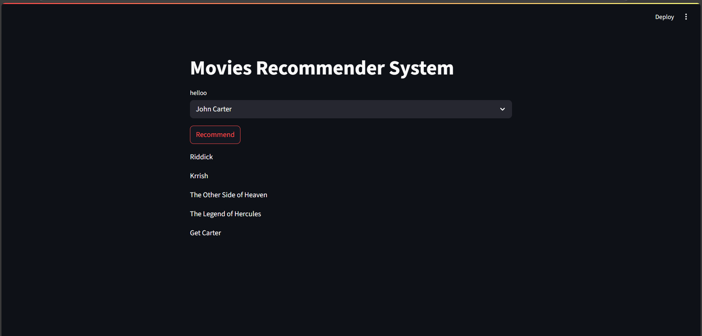

# 🎬 Movie Recommender System

A **content-based movie recommendation system** built using Python and Streamlit.  
It is trained on 5,000+ movies and recommends the top 5 similar titles based on user input using text vectorization (Bag of Words with stemming).

---

## 🔍 Features

- ✅ Recommends top 5 movies based on similarity
- ✅ Trained on 5,000+ movie data entries
- ✅ Uses **Bag of Words** and **stemming** for content vectorization
- ✅ Simple and interactive **Streamlit UI**
- ✅ Developed and tested in PyCharm

---

## 🛠 Tech Stack

- Python
- Pandas, NumPy
- Scikit-learn
- NLTK (for stemming)
- Streamlit

---

## 🚀 How to Run Locally

1. **Clone the repository**  
2. **Refer kaggle for dataset**  
3. **Perform data processing referring .pynb**  
4. **Run on pycharm: streamlit run app.py**  

## Screenshot of the web page:
